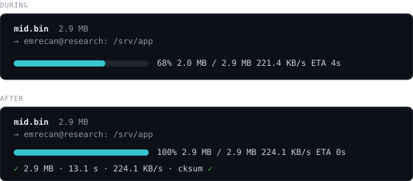

# herdr-drop

Drag a file onto a [Herdr](https://herdr.dev) pane, press a key, and it lands in
that pane's current directory — on the machine the pane is on. An ssh session
needs nothing installed at the other end.



Your terminal already pastes the dropped file's path into the pane. This plugin
reads that path, clears the line, and streams the file through the same pty into
`base64 -d` on the other side. No extra ssh connection, no agent on the server,
no replacement for `ssh`.

## Install

Requires Herdr ≥ 0.9.0 and Python 3 locally. Linux and macOS.

```bash
herdr plugin install ecylmz/herdr-drop
```

Then bind a key in `~/.config/herdr/config.toml` and run
`herdr server reload-config`:

```toml
[[keys.command]]
key = "prefix+shift+d"
type = "plugin_action"
command = "herdr-drop.upload"
description = "Upload dropped file"
```

Check the key is free first — `herdr --default-config` lists Herdr's own
bindings.

## Use

1. Drag the file onto the pane. Your terminal pastes its path at the prompt.
2. Press the key. A popup shows the transfer; the prompt line is cleared for you.
3. The file is in that pane's working directory.

Works the same whether the pane is a local shell, an `ssh` session, or a
`herdr machine` pane. The remote side needs only `base64`, `cksum` and `stty` —
POSIX tools that ship with every Linux and macOS.

The pane is left with one line of evidence, which is also what does the work:

```
emrecan@research:/srv/app$ stty -echo; base64 -d > mid.bin; stty echo; cksum mid.bin
3803138497 3000000 mid.bin
```

## Verification

The ✓ is not optimistic. When the last chunk has been handed over, the plugin
waits for that `cksum` line and compares it with the local `cksum` of the file —
POSIX `cksum` gives the same CRC on Linux and macOS. Only a match prints ✓.

Anything else is a failure, with both checksums shown:

```
  ✗ not verified · local 3945516409 200000 · remote no answer
  the file may be truncated or corrupt: big.bin
```

The wait has a budget of `max(30 s, size / 50 KB/s)`, and the popup counts up to
it while the pty buffer drains.

## Limits

Everything travels through the terminal, so throughput is the pty's, around
200 KB/s. That is fine for a config file, a patch, a certificate, a small
archive. **Above ~5 MB, use `scp`** — this plugin is for the file you are
holding, not for a backup.

The progress bar counts bytes handed to Herdr, which can run ahead of the pty by
a few hundred KB. The checksum at the end is the part that tells the truth.

Binary-safe: the file is base64-encoded before it enters the terminal, so
control characters never reach the remote line discipline.

<details>
<summary>From source, for development</summary>

```bash
git clone https://github.com/ecylmz/herdr-drop
cd herdr-drop
herdr plugin link "$PWD"
```

There is no build step. `./herdr-drop --test` runs the self-checks.

A linked plugin cannot be installed over — `herdr plugin unlink herdr-drop`
first.

</details>

<details>
<summary>Why a key and not the drop itself</summary>

Herdr has no hook for a paste or a drop, and its link handlers only match
http(s) URLs — a dropped path never becomes a clickable link. So the drop
puts the path on the prompt, and the key turns it into a transfer.

</details>

## Uninstall

```bash
herdr plugin uninstall herdr-drop
```

Remove the `[[keys.command]]` block you added and reload the config.

## License

MIT
